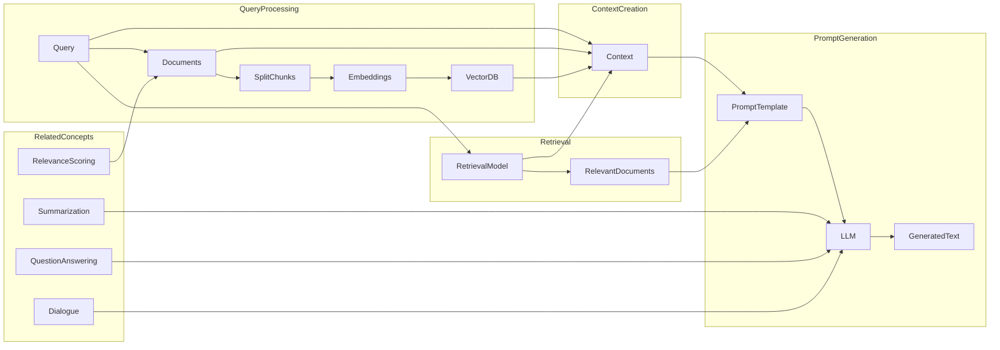

# Retrieval Augmented Generation (RAG)

RAG combines the power of retrieval-based methods and generative models in natural language processing. In simple terms, it involves using a retrieval system to fetch relevant information or context, which is then used by a generative model to generate a response or output.

Here's how it works: First, a retrieval system is employed to retrieve relevant information from a large corpus or knowledge base. This retrieval can be based on keywords, similarity measures, or other techniques. Once the relevant information is obtained, a generative model, such as a language model or a neural network, utilizes this retrieved context to generate a response or output.

This approach allows the generative model to benefit from the knowledge and context present in the retrieved information, enhancing the quality and relevance of the generated output. It can be particularly useful in tasks like dialogue systems, question answering, or content generation, where having access to relevant information can greatly improve the generated responses.

In essence, Retrieval Augmented Generation combines the strengths of retrieval-based methods, which excel at finding relevant information, with generative models, which are skilled at generating coherent and context-aware responses. This synergy enables more effective and contextually grounded natural language generation.

## The Embedding Process in RAG

RAG utilizes a two-step embedding process:

### 1. Document Embedding:
- First, the documents in the retrieval corpus are preprocessed. This typically involves tokenization, lowercasing, and removing stopwords and punctuation.
- Each preprocessed document is then passed through a pretrained language model, such as BERT or T5, to obtain contextualized word embeddings. These embeddings capture the meaning and context of each word in the document.
- To represent the entire document, the individual word embeddings are combined. This can be done by taking the mean or max pooling over the word embeddings.
- The resulting document embeddings represent the semantic content of each document in the retrieval corpus.

### 2. Query Embedding:
- The input query (question) undergoes a similar preprocessing step as the documents, including tokenization and lowercasing.
- The preprocessed query is also passed through the same pretrained language model to obtain contextualized word embeddings.
- Similar to the document embedding, the word embeddings for the query are combined to obtain a single query embedding that captures its semantic meaning.

The document and query embeddings are then used to perform retrieval and ranking of relevant documents for a given query. This is typically done by measuring the similarity between the query embedding and document embeddings using methods like cosine similarity or dot product. The documents with the highest similarity scores are considered the most relevant to the query.

Once the relevant documents are retrieved, RAG can utilize the retrieved information to generate relevant and coherent responses. The retrieved documents serve as a knowledge source that can be used to augment the generation process, allowing the model to provide accurate and informative responses.

Overall, the embedding process in RAG involves encoding both the documents and queries into meaningful numerical representations, enabling effective retrieval and generation of natural language responses.

Here's a breakdown of the diagram:

### Query Processing:

- The process starts with a **Query**, which is used to retrieve relevant **Documents**.
- The documents are then **Split** into smaller chunks for efficient processing.
- **Embeddings** are generated for each chunk and stored in a **VectorDB**.

### Context Creation:

- The **Context** is created by combining the **Query** with the relevant **Document Chunks** and **Embeddings**.

### Prompt Generation:

- The **Context** is passed to a **Prompt Template**, which structures it into a format compatible with the **LLM**.
- The prompt is then passed to the **LLM**, which generates **Text**.

### Retrieval:

- In addition to the main RAG process, the diagram also includes a **Retrieval** subgraph.
- The **Query** is passed to a **Retrieval Model**, which retrieves **Relevant Documents**.
- These **Relevant Documents** are then used to enhance the **Prompt Template**, providing additional context for the LLM.

### Related Concepts:

- The diagram also acknowledges other related concepts, such as **Relevance Scoring**, **Summarization**, **Question Answering**, and **Dialogue**. These concepts can be integrated into the RAG process to improve its effectiveness.